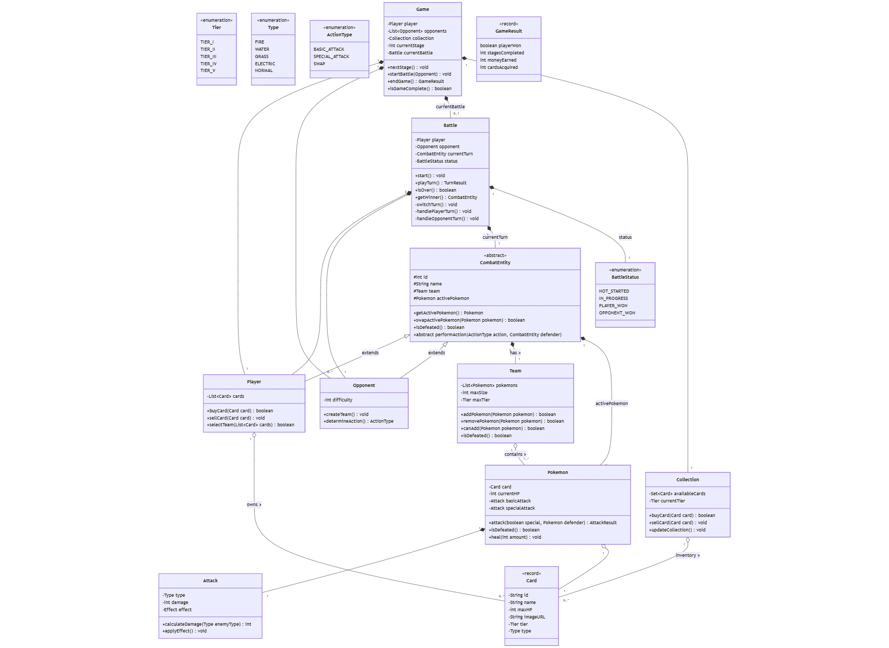
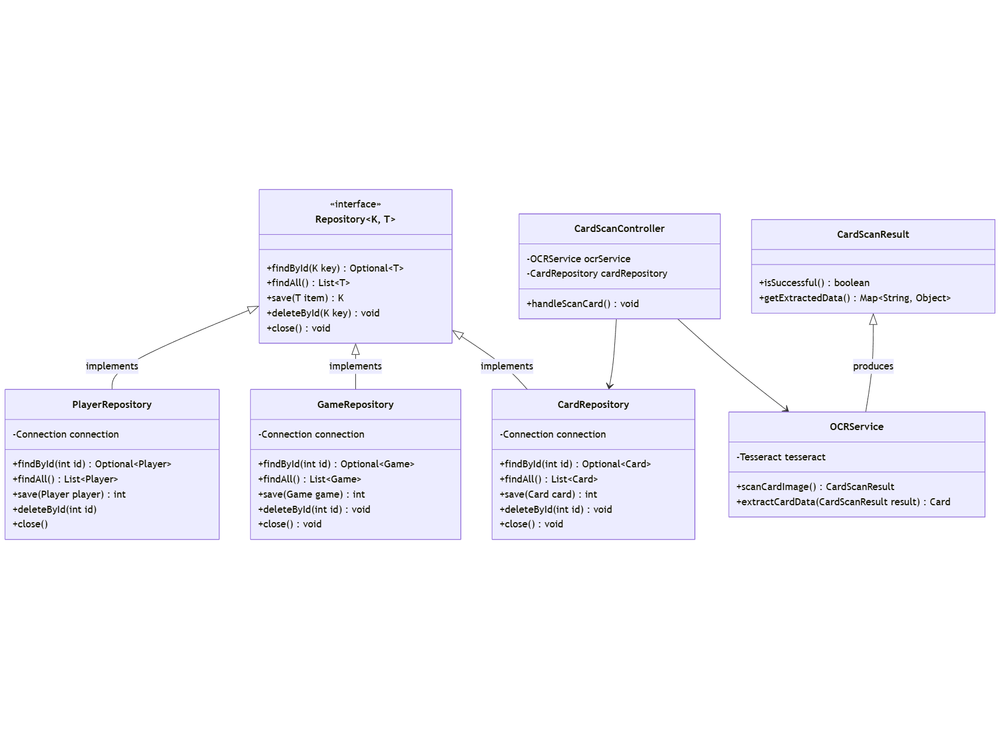
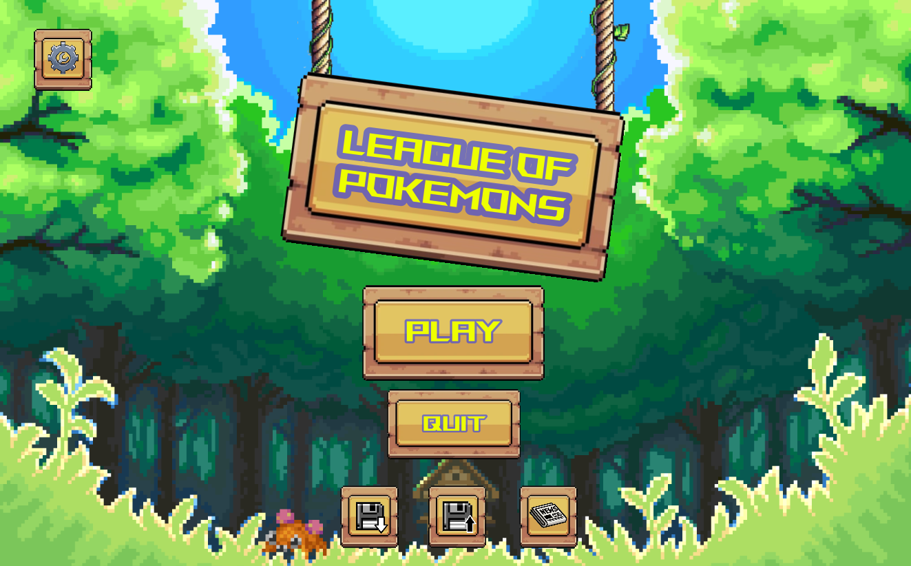
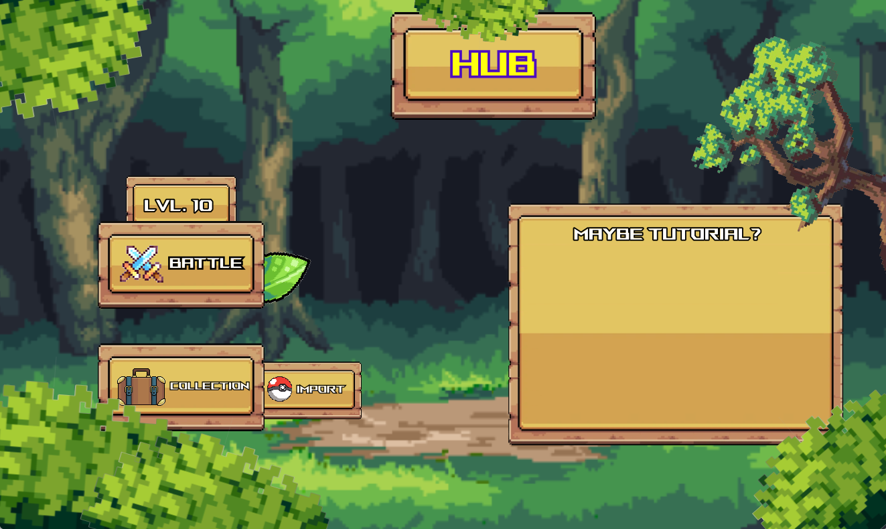
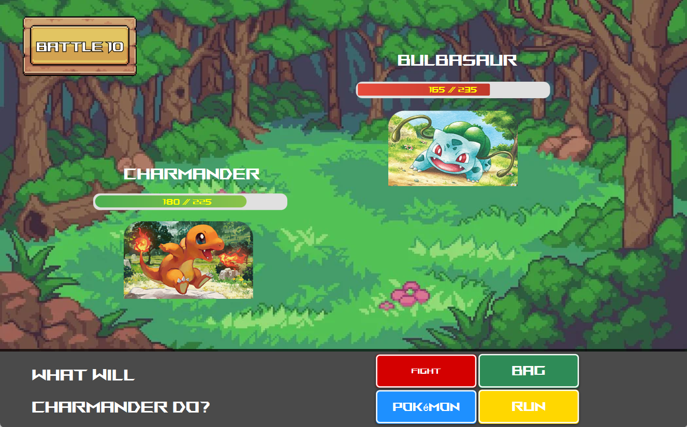
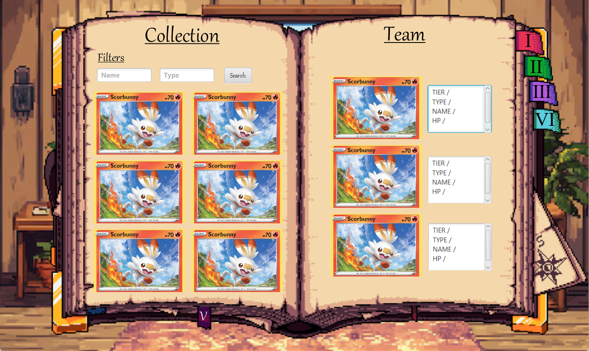
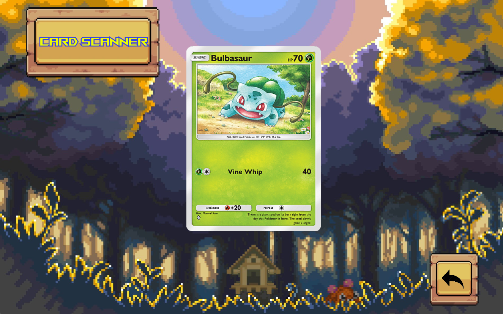

# League Of Pokemons

  

## Authors

- Group : **D112**
- g63491 Schellekens Thibault
- g63054 Mocircioiu Prodea Marian

## Project description

This project is a Pokémon game where players can build their ultimate team by selecting their favorite Pokémon cards from a growing collection. Players can scan and add their own cards to expand their roster, allowing them to recruit new Pokémon.

Battles become increasingly challenging, and with each victory, players earn the ability to recruit even more powerful Pokémon. The game also features a save and load system, ensuring progress is never lost.

The goal is to strenghen your team, win battles, and defeat the final Boss to claim victory.

### The Card Collection

The collection consists of a set of Pokémon cards from which players can select their desired Pokémon to form their team.

When a Pokémon is chosen, the application first checks its cache to see if the card has already been scanned. If not, an OCR process will extract and store the card's information.

The collection is organized into multiple **[Tiers](#pokémon-tiers)**, ranked from lowest to highest, ensuring a structured progression of Pokémon strength.

### Scanning Player's Pokémon Cards

Players can scan their own Pokémon cards by uploading an image file that meets specific reWhorements (e.g., size, positioning).

Once a new card is scanned, its information is stored in the collection, making it available for the player to use in battles.

### Pokémon Tiers

With each victory up to stage 5, the player unlocks a new tier of Pokémon:

- **Tier I** → Pokémon with up to 100 HP
- **Tier II** → Pokémon with up to 140 HP
- **Tier III** → Pokémon with up to 180 HP
- **Tier IV** → Pokémon with up to 220 HP
- **Tier V** → All Pokémon available

### Player's team

In each battle, the player can use up to **three Pokémon**.

Before entering a battle, the player must assemble a team, ensuring that the selected Pokémon meet the required [**Tier](#**pokémon-tiers) for that stage.

### Battle System

Once the team is assembled, the player can enter a battle. The opponent is determined based on the current game stage.

During each turn, the player can choose to:

- **Attack** using the active Pokémon
- **Swap** the active Pokémon with another one from the team

If a Pokémon is defeated in battle, it becomes unavailable for the rest of the game.

The battle ends when all Pokémon on either side are defeated—the player wins by eliminating all of the opponent’s Pokémon.

### End Game

The game can end in two possible scenarios:

1. **Defeat** – The player loses if a certain number of Pokémon are lost (exact limit to be determined).
2. **Victory** – The player wins by defeating the final Boss, a powerful Pokémon with unique attacks and effects (details to be determined).

### Saving Progress

Players can **save** their game and **reload** it later to continue from where they left off.

When loading a saved game, all progress, including the player's team and game state, will be fully restored, allowing them to resume their adventure.

## Class diagram

The class diagram below illustrates the structure of the application's **core model** classes.



The class diagram below illustrates the structure of the application's **util** classes.



## Choice of Architecture

The architecture chosen for this project is model-view-controller.

## FXML Files Preview

The project has 5 main FXML files

1. 

2. 

3. 

4. 

5. 

## Functional Testing Plan

### OCR Tests

| ID  | Test Description                              | Input Data                             | Expected Result                                          |
|-----|-----------------------------------------------|----------------------------------------|----------------------------------------------------------|
| **OCR-1** | Test Pokémon card scanning                   | Upload an image of a Pokémon card      | The card's information should be extracted and stored in the collection. |
| **OCR-2** | Test OCR functionality for card scanning     | Upload an image of an unscanned Pokémon card | The OCR should successfully extract and store the card's information. |
| **OCR-3** | Test card scanning with incorrect requirements | Upload an image with incorrect size or positioning | The card should not be scanned, and an error message should appear. |
| **OCR-4** | Test OCR failure to scan card                | Upload a blurry or poorly captured image | The OCR should fail to extract information and prompt the player to try again. |

### Team Tests

| ID  | Test Description                              | Input Data                             | Expected Result                                          |
|-----|-----------------------------------------------|----------------------------------------|----------------------------------------------------------|
| **TEAM-1** | Test team formation before battle             | Select 3 Pokémon from the collection   | The team should be successfully assembled with the selected Pokémon. |
| **TEAM-2** | Test entering battle with an empty team      | Select "Battle" with less than 3 Pokémon in the team | The player should not be able to enter the battle and should receive a warning to complete the team. |
| **TEAM-3** | Test tier unlocking after a battle victory   | Win a battle at stage 1                | The player should unlock the next tier of Pokémon. |
| **TEAM-4** | Test selecting a Pokémon from an unavailable tier | Select Pokémon from a higher tier than allowed at the stage | The system should prevent selection and show a message indicating the tier requirement is not met. |

### Battle Tests

| ID  | Test Description                              | Input Data                             | Expected Result                                          |
|-----|-----------------------------------------------|----------------------------------------|----------------------------------------------------------|
| **BATTLE-1** | Test battle start                             | Select "Battle" from the HUB menu      | The game should transition to the battle screen, with the correct opponent. |
| **BATTLE-2** | Test Pokémon action in battle (Attack)       | Choose a Pokémon and attack            | The attack action should execute successfully and reduce the opponent's HP. |
| **BATTLE-3** | Test Pokémon swap in battle                  | Swap the active Pokémon with another   | The active Pokémon should change. |
| **BATTLE-4** | Test defeat of a Pokémon during battle       | Defeat a Pokémon from the player's team | The defeated Pokémon should be marked as unavailable for the rest of the game. |
| **BATTLE-5** | Test battle victory                          | Defeat all opponent's Pokémon          | The player should win the battle, and a victory message should be shown. |
| **BATTLE-6** | Test end game victory condition              | Defeat the final boss                  | The game should end with a victory message. |
| **BATTLE-7** | Test end game defeat condition               | Lose all Pokémon during a battle       | The game should end with a defeat message. |
| **BATTLE-8** | Test trying to swap a Pokémon when no Pokémon are available | Attempt to swap Pokémon during battle with no available ones | The game should display a message indicating that there are no Pokémon available for swap. |

### Save/Load Tests

| ID  | Test Description                              | Input Data                             | Expected Result                                          |
|-----|-----------------------------------------------|----------------------------------------|----------------------------------------------------------|
| **SAVELOAD-1** | Test saving game progress                    | Click "Save" in the HUB menu           | The game state, including the player's team, should be saved and available for future loading. |
| **SAVELOAD-2** | Test loading game progress                   | Click "Load" in the HUB menu           | The previously saved game state should be loaded, allowing the player to continue from where they left off. |

## Weekly Task Schedule

### Week 1 - 6H

| Who      | Description |
| -------- | ----------- |
| All      | Project analysis, readme completed      |
| Thibault | FXML - Battle Scene + Scanner Scene      |
| Marian   | FXML - Main Menu Scene, Hub Scene, Collection Scene     |

### Week 2 - 6H

| Who      | Description |
| -------- | ----------- |
| All      | Implementation of Model      |
| Thibault | OCR Service      |
| Marian   | DataBase Connection      |

### Week 3 - 6H

| Who      | Description |
| -------- | ----------- |
| All      | Implementation of Model      |
| Thibault | _TBD_      |
| Marian   | _TBD_      |

### Week 4 - 6H

| Who      | Description |
| -------- | ----------- |
| All      | Implementation of MVC      |
| Thibault | _TBD_      |
| Marian   | _TBD_      |

### Week 5 - 6H

| Who      | Description |
| -------- | ----------- |
| All      | Preparing final release      |
| Thibault | _TODO_      |
| Marian   | _TODO_      |


## Installation and Usage

To use the application, follow these steps:

1. Clone this repository :

   ```bash
   git clone ...
   ```

2. Start the project by running the command :
   ```bash
   mvn ...
   ```

## Known Issues of the Application

During the functional testing, we identified the following issues:

- ...

## Retrospective

We observed the following differences between the initially imagined class diagram and the implemented version:

- ...
